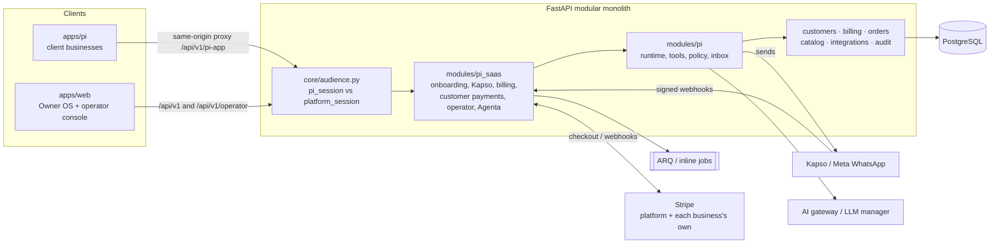
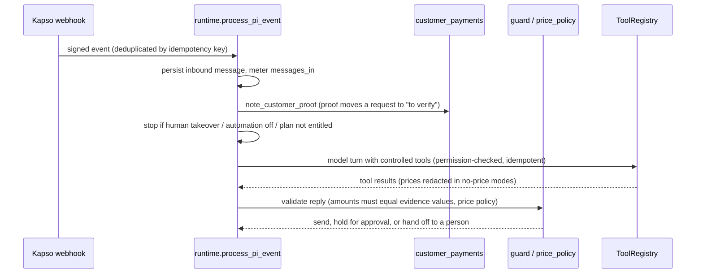
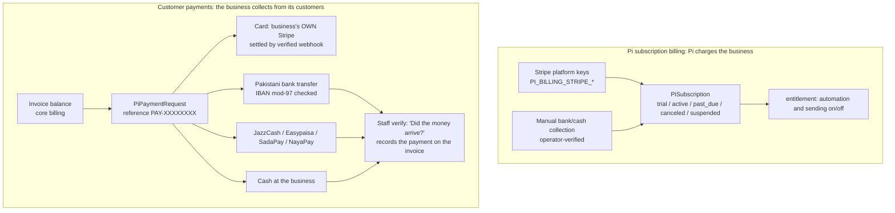

# Pi WhatsApp SaaS: architecture and handoff

Last updated 30 September 2026. Brief: [PI_WHATSAPP_SAAS_CLAUDE_PROMPT.md](PI_WHATSAPP_SAAS_CLAUDE_PROMPT.md).
The requirement matrix (section 9) states what was **implemented**, what was **verified
locally**, and what is **blocked on credentials** or **remaining**. Mocks and provider
doubles are never counted as live verification.

Nothing has been deployed. No number was purchased, no real customer was charged and no
real WhatsApp message was sent.

## 1. What this is

| Product | Who uses it | Where |
| --- | --- | --- |
| **Pi WhatsApp, standalone** | External businesses (clients) and their teams | `apps/pi` (Next.js, own origin) → `/api/v1/pi-app/*` |
| **Pi WhatsApp, Owner OS edition** | Owner OS workspaces | `apps/web` → `/api/v1/pi/*` (unchanged, shared services) |
| **Operator console + Pi (Agenta)** | The Pi business's own team (admins) | `apps/web` `/operator/*` → `/api/v1/operator/*` |

One FastAPI backend and one PostgreSQL database serve all three. A standalone business is
an ordinary tenant, provisioned behind the scenes with a `PiBusinessAccount`, so Pi reuses
the CRM, orders, billing, memory and policy models instead of copying them.

## 2. Architecture



**Isolation.**
- **Separate sessions.** Pi app sessions (`pi_session`, `pi_csrf`, `PI_APP_ORIGINS`) and
  Owner OS sessions never cross; `AuthSession.audience` is checked on every request.
- **Scoped data.** Every query goes through `WorkspaceScope` and `WorkspaceRepository`
  (tenant, environment, permissions).
- **Record-level inbox.** Without `pi.inbox.all`, a member sees only conversations
  assigned to them.
- **Operator gating.** Operator routes re-check the operator's membership and
  capabilities on every request.

### Inbound message runtime



### Onboarding (client)

Sign up → 1 Business (currency guessed from time zone) → 2 What you offer →
3 Connect WhatsApp (Kapso hosted setup; or request a new number, which gets an
operator quote the customer must confirm) → 4 How Pi should help (tools, price policy,
automation mode) → 5 Try Pi and launch (readiness gates). Progress is saved at every step,
and "Help me set up" notifies operators.

## 3. Admin side: the admin console (Super admin, Admin, Operators)

Owner OS → account menu → **Admin console** (also Settings → Admin console), or
`/operator` directly. It is available only to users with an active `PiOperatorMember`
row, and it opens even when that person has no workspace of their own.

There are three tiers. The stored role keys are unchanged, because of a database check
constraint:
- **Super admin** (`owner`): everything.
- **Admin** (`operations_admin`): every workspace, user and Pi business, but not the operator team, plans or platform keys.
- **Operators** (`onboarding_specialist`, `support`, `billing`, `analyst`): Pi work only.

Super admins and admins can create a workspace for someone, and that person becomes its owner. They can also add, change and remove workspace members. Someone new gets an invite link.

Some rules always apply:
- Only a super admin gives, changes or removes a workspace owner.
- Every workspace keeps one owner.
- Nobody edits their own membership from the console. Grant the first owner from the
server; there is deliberately no HTTP route for this:

```bash
cd apps/api   # with the target database configured, never a guess
python -m app.modules.pi_saas.bootstrap_operator admin@example.com owner
```

| Page | What operators do |
| --- | --- |
| Overview | **Ask Pi (Agenta)**, counts by state, 24h health, platform configuration status |
| Pi businesses | Search/filter; detail with go-live checklist, WhatsApp connection, subscription (change plan), payment methods the business has switched on, usage, support access; pause/resume, suspend/reinstate, number quotes |
| Workspaces | Every Owner OS workspace, including Pi businesses. Create a workspace for an owner; manage its members and their roles; suspend or reactivate it (not your own) |
| Subscription payments | Manual bank/cash collection for Pi subscriptions (billing peer's `pi-billing` feature) |
| Plans | Starter / Growth / Business plans and their Stripe price IDs (no prices invented) |
| Failed work | Failed provider events and messages; replay |
| Admins & operators | Add super admins, admins and operators, change their role, revoke them; per-capability overrides |
| Conversations | Only with a support grant the business approved; time-limited and audited on every read |

### Operator roles

| Capability | owner | operations_admin | onboarding_specialist | support | billing | analyst |
|---|---|---|---|---|---|---|
| accounts.read | Y | Y | Y | Y | Y | Y |
| accounts.all (not only assigned) | Y | Y |  |  | Y | Y |
| accounts.manage | Y | Y |  |  |  |  |
| onboarding.assist | Y | Y | Y |  |  |  |
| support.request | Y | Y | Y | Y |  |  |
| numbers.manage | Y | Y | Y |  |  |  |
| billing.read | Y | Y |  |  | Y |  |
| billing.manage | Y | Y |  |  | Y |  |
| plans.manage | Y |  |  |  |  |  |
| health.read | Y | Y |  | Y |  |  |
| jobs.replay | Y | Y |  | Y |  |  |
| analytics.read | Y | Y |  |  |  | Y |
| team.manage | Y |  |  |  |  |  |
| workspaces.read | Y | Y |  |  |  | Y |
| workspaces.manage | Y | Y |  |  |  |  |

Team rules, enforced in the API and tested:
- Nobody can change their own operator role.
- Only owners can change or revoke owners.
- An operator can never grant access they don't hold themselves.
- At least one owner always remains.

Reactivating a workspace undoes only a business suspension that the workspace action
itself caused. A separate business suspension (for example for abuse) stays in place.

### Pi (Agenta)

`POST /api/v1/operator/pi/agenta/ask` (`app/modules/pi_saas/agenta.py`).

- **Topic routing.** English or Roman Urdu questions are routed by keyword to one of six
  topics: attention, billing, setup, health, workspaces, summary.
- **Facts.** They come from the same `list_accounts`, `health` and workspace functions as
  the console, with the asking operator's capabilities and assignments. If a capability is
  missing, Agenta says so; it never widens access. Facts contain no customer conversation
  content.
- **Wording.** A deterministic template writes the answer. When a model is configured, it
  may word the answer instead, but every number it writes must be a number in the facts;
  otherwise the template answer is used. The UI labels which of the two produced it.
- **Controls.** Every question is audited (`pi_operator.agenta_asked`) and limited to
  30 per operator per hour. Model calls are platform cost (`scope=None`), not billed to any
  workspace.

## 4. Payments: two separate systems



**Customer payment rules** (`customer_payments.py`, tested):
- The amount is always the current invoice balance. Pi never picks or types an amount;
  the message is built deterministically.
- Bank, wallet and cash payments count only after staff verification. A screenshot, or
  the customer saying "bhej diya", moves the request to **"Customer says paid"** in the
  **To handle** queue, but never marks it paid.
- Account details are snapshotted per request, so later edits don't change instructions
  already sent.
- There is one live request per invoice, method and balance.
- A Stripe request expires after 23h with its Checkout session. A new request gets a new
  session, and a card payment that settles after expiry is still recorded.
- A request can't be sent into another customer's conversation.
- Card payments can't be switched on until the business connects its own Stripe account;
  saving the other methods is never blocked by this.
- Only `billing.write` holders can create, verify or send requests.

## 5. Growth features (added 30 September)

| Feature | How it works | Where |
| --- | --- | --- |
| **Teach Pi from a file or voice note** | PDF (pypdf, ≤80 pages), Word .docx (standard library, DOCTYPE refused), text, photo (vision) or voice note (transcription) → a **draft** to review. File type is decided from the content, never the name. Scanned PDFs are refused with a hint to upload photos. Nothing is customer-visible until someone with `pi.knowledge.publish` publishes it. Direct-ingest routes now also require publish. | `pi_saas/teach_files.py`, `POST /pi-app/knowledge/upload`; My Pi → Business knowledge |
| **Marketing consent** | Recorded per customer with where they agreed (staff must write the source). Replying only "STOP" (or "band karo", "مت بھیجو" …) withdraws marketing **and** reminder consent at once. Reminder consent captured in chat is copied to the customer record. | `pi_saas/campaigns.py`; customer profile → Messaging permission |
| **Campaigns** | Consented customers only, optionally a tag. One approved, no-variable template, checked live before scheduling and again at every send. Growth/Business plans only (`PLAN_FEATURE_REQUIRED`). Quiet hours in the business time zone, a daily limit, a recipient cap, and the plan's monthly message allowance. Every send is re-checked: campaign not cancelled, consent still granted, no person chatting with them in the last 24 h. Results come from real delivery statuses (sent/delivered/read/replied) plus reasons for skips. | `pi_saas/campaigns.py`, `campaign_routes.py`, sweep `sweep_pi_campaigns`; Customers → Campaigns |
| **Reminders end to end** | Quiet hours (default 21:00–09:00, configurable, can be turned off). The monthly allowance is respected. Consent is synced to the customer record. The template approval check is shared with campaigns. | `pi/followups.py`; My Pi → Follow-ups |
| **Weekly summary** | Every Monday 08:00 (business time), last week's real counts: customers, replies, new customers, enquiries, bookings, payments confirmed, campaign messages, and what's waiting. Created once per week and kept for looking back. Always in-app (notification + Home card). Emailed to the owner only when they switch it on **and** an email service is connected; otherwise the reason is shown. | `pi_saas/digests.py`, `digest_routes.py`; Home |
| **Operator weekly view** | New businesses, businesses that went live, messages and Pi replies over 7 days, plus the Agenta attention facts, all scoped to the operator's capabilities and assignments. | `GET /operator/pi/weekly`; operator Overview |
| **Calendar invitations** | The booking confirmation email carries an RFC 5545 `.ics` (PUBLISH, UTC times, stable UID so a changed booking updates the same calendar entry). The email layer accepts only small `text/calendar` attachments, on Resend, SendGrid and SMTP. | `pi_saas/calendar_invite.py`, `integrations/email.py` |
| **WhatsApp Flows (forms)** | The business publishes a Flow in WhatsApp Manager and registers it (lead / booking / feedback). The opt-in `send_form` tool sends it inside the 24-hour window. Replies are accepted only with an HMAC token bound to that conversation and purpose. Forged or forwarded replies are rejected and audited. Answers go to the conversation brief and customer memory as the customer's own words. Button and list taps are now read as text instead of "other". | `pi_saas/flows.py`, `pi/tools/flow_handlers.py`; My Pi → Follow-ups |
| **Usage caps** | Storage allowance (`storage_mb`) enforced when publishing knowledge (`STORAGE_LIMIT_REACHED`) and shown on the usage page. Campaigns and reminders stop at the monthly message allowance and wait instead of overspending. Seat caps existed already. | `pi_saas/entitlement.py` |

New permissions: `pi.campaigns.read` (owner, admin, manager, viewer) and
`pi.campaigns.manage` (owner, admin, manager). Migration 0010 adds them to existing
tenants' system roles.

## 5b. Client permission matrix (Pi app team roles)

| Permission | owner | admin | manager | member | viewer | billing |
|---|---|---|---|---|---|---|
| pi.read | Y | Y | Y | Y | Y |  |
| pi.inbox.all (every conversation) | Y | Y | Y |  | Y |  |
| pi.inbox.reply / notes | Y | Y | Y | Y |  |  |
| pi.inbox.assign | Y | Y | Y |  |  |  |
| pi.handoffs.manage | Y | Y | Y | Y |  |  |
| pi.memory.read | Y | Y | Y | Y |  |  |
| pi.customers.export | Y | Y |  |  |  |  |
| pi.knowledge.manage / publish | Y | Y |  |  |  |  |
| pi.agents.manage, pi.settings.manage, pi.whatsapp.manage | Y | Y |  |  |  |  |
| pi.support.grant | Y | Y |  |  |  |  |
| pi.bookings.read | Y | Y | Y | Y | Y |  |
| pi.bookings.manage, pi.work.manage | Y | Y | Y | Y |  |  |
| pi.work.read | Y | Y | Y | Y | Y |  |
| pi.campaigns.read | Y | Y | Y |  | Y |  |
| pi.campaigns.manage | Y | Y | Y |  |  |  |
| pi.analytics.read | Y | Y | Y |  | Y |  |
| pi.billing.read (Pi subscription) | Y | Y | Y |  |  | Y |
| pi.billing.manage | Y | Y |  |  |  | Y |
| billing.read (customer invoices) | Y | Y | Y |  | Y |  |
| billing.write (invoices, payment requests) | Y | Y | Y |  |  |  |
| customers.read | Y | Y | Y | Y | Y |  |
| customers.write | Y | Y | Y | Y |  |  |

Pi's own runtime acts with `PI_SYSTEM_PERMISSIONS`. Every tool declares one permission,
and opt-in tools (payments, bookings writes, connectors) stay off until a business turns
them on.

## 5c. WhatsApp through Kapso: number pool, Owner OS, Setup Center

**Kapso is used by both products.**
- Standalone Pi businesses and Owner OS workspaces connect WhatsApp through the
  platform's single Kapso project.
- Nobody pastes Meta keys. Meta keys remain an "Advanced" option in Owner OS.
- Connection code is shared (`pi_saas/connections.py`, one `Target` per tenant
  environment).
- Inbound messages route by `phone_number_id`, so Kapso customers are only an
  organizational label.

| Piece | How it works | Where |
| --- | --- | --- |
| **Number pool** | The operator adds numbers the platform owns under one Kapso "Pi number pool" customer: a new pre-verified US number via a Kapso setup link (Kapso credits), or an existing number via `connect-phone-number` with a permanent System User token (sent to Kapso once, never stored). "Sync from Kapso" lists every project number with its problems. | `pi_saas/number_pool.py`, `operator_number_routes.py`, operator **Numbers** tab |
| **Blocking problems** | Meta test / display-name-only numbers (+1 555 …), RED quality, inbound processing off, sandbox. These numbers are never offered to businesses; sandbox numbers can be offered by an operator for testing. | `kapso.PhoneNumber.warnings` |
| **Client chooses** | Onboarding step 3 and Settings → WhatsApp in the Pi app, and Pi → WhatsApp in Owner OS, list the available numbers (number, country, the operator's price label). Choosing links it at once, row-locked so two businesses can't take one number. Choosing is the business's consent. | `/pi-app/whatsapp/numbers`, `/pi/whatsapp/numbers` |
| **Operator offers** | "Offer to…" sets a number aside for one business or workspace. They get a notification and accept it on their WhatsApp page. The offer can be withdrawn. | `POST /operator/pi/numbers/{id}/offer` |
| **Own number** | Still available ("Use my own number (advanced)"): Kapso hosted setup (coexistence or dedicated). Owner OS returns to `/pi/whatsapp/connected`, the Pi app to `/settings/whatsapp/connected`. | `/pi/whatsapp/kapso/*` |
| **Webhooks** | When a number is linked, the API creates that number's Kapso webhook (`{INTEGRATIONS_PUBLIC_BASE_URL}/api/v1/webhooks/kapso`, message events, our secret). It checks first, so it never duplicates. No manual webhook setup in Kapso. | `connections.register_webhook` |
| **Releasing** | A released pool number is retired, never recycled, so a new owner can't receive the old business's customers' replies. | `number_pool.release_for` |
| **Fees** | `KAPSO_META_BILLING_MODE=partner_managed`: Meta fees come from the platform's Kapso credits and are recovered through Pi plans. The operator Overview shows this month's messages per business. Kapso has no documented balance API, so the card links to Kapso's dashboard. | `/operator/pi/whatsapp-usage` |
| **Templates** | Listed from Kapso (approval status, and whether Pi can send it: plain text, no variables or buttons). New templates can be sent to Meta for review from the app. | `pi_saas/whatsapp_tools.py`, My Pi → Follow-ups |
| **One-click forms** | Customer details, booking request and feedback Flows are created and published on the number through Kapso's Flows API. The Flow id is saved automatically. | `POST /pi/whatsapp/forms/{purpose}/create` |
| **Setup Center** | One list of every tool (WhatsApp, AI, email, Stripe, Google Calendar, Shopify, S3) with state, where to fix it, and **Test all**. The operator gets a platform checklist of server settings. | Pi app Settings → Setup; Owner OS `/pi/setup`; operator Overview |
| **Connectors in Owner OS** | Google Calendar and Shopify now connect from Owner OS too. OAuth returns to the app it started from, so both redirect URIs must be registered in the Google and Shopify apps. | `connector_routes.build("web")` |

### Operator guide (Roman Urdu)
1. **Server par rakhein** (chat mein kabhi nahi):
   - `KAPSO_API_KEY`, `KAPSO_WEBHOOK_SECRET`
   - `INTEGRATIONS_PUBLIC_BASE_URL`: API ka `https://` address
   - `KAPSO_META_BILLING_MODE=partner_managed`
   - Kapso dashboard mein project credits.
2. **Numbers tab kholein.** Pehli dafa khulne par "Pi number pool" customer khud ban jaata hai.
3. **Naya number:** "New number from Kapso" daba kar Kapso ka page khulega. Wahan **Verified (BSP) number** chunein, "display name only / virtual number" kabhi nahi. Wapas aa kar "Sync from Kapso" dabayein.
4. **Maujooda number:** "Connect a number we own" mein Phone number ID, WABA ID aur **System User ka permanent token** daalein. Token sirf Kapso ko jaata hai.
5. **Har number par:** mulk aur "price label" likhein (jo business ko dikhega, maslan "Included in Growth"). Qeemat system khud nahi banata.
6. **Business khud chune**, ya aap "Offer to…" se kisi business/workspace ke liye rakh dein. Wo apne WhatsApp page par accept karega.
7. **+1 555 wala number** ("Meta test number" warning) pool mein kisi ko nahi diya jayega. Use Kapso mein delete karein.

## 5d. Paid journey: review → approval → payment → WhatsApp, platform keys, plans, notifications

**How a business goes live**
1. **Sign up.** The business gets the trial plan and can use "Try Pi" at once. WhatsApp
   does not connect on a trial.
2. **Business review.** Settings → Business review (`/settings/business-review`). The
   business sends its business name, address, city, phone, website/page and what it sells.
   No personal ID or documents are collected.
3. **Operator decision.** Owner OS → Operator → Reviews (`/operator/reviews`): approve,
   ask for changes (note required) or decline. Deciding needs `operator.accounts.manage`;
   viewing needs `operator.onboarding.assist`.
4. **Payment or free plan.** Paid means the subscription is `active` (Stripe, or a bank /
   cash payment verified by staff on Subscription payments), or the operator gave a free
   plan (price 0) from the business's plan dialog. Free plans never expire.
5. **WhatsApp.** The business may pick a pool number at any time. Before steps 2-4 are done
   the number is **held** for it (`pi_pool_numbers.held_until`,
   `PI_NUMBER_HOLD_DAYS`, default 7). It connects automatically, with its webhook, as soon
   as the gate opens. The same gate blocks "use my own number" until then.

| Piece | Where |
| --- | --- |
| Gate (reasons REVIEW_REQUIRED, AWAITING_APPROVAL, CHANGES_REQUESTED, REVIEW_DECLINED, PAYMENT_REQUIRED) | `pi_saas/access_gate.py`; `GET /pi-app/whatsapp/access`; `PI_WHATSAPP_REQUIRES_APPROVAL=true` (Owner OS workspaces are never gated) |
| Hold / release / auto-connect | `number_pool.pick`, `release_hold`; `lifecycle_notify.activate_held` |
| Review | `pi_saas/verification.py`, `review_routes.py`, table `pi_business_verifications` |
| Journey notifications | `pi_saas/lifecycle_notify.py`: welcome, review received/approved/changes/declined, plan active / payment received, number held/connected/released, hold expiring, trial ends in 3 days/1 day. In-app always; email per category (Settings → Notifications) through the workspace email integration or platform SMTP. The sweep (`sweep_pi_saas`) catches changes made by any path (Stripe webhook, bank/cash approval, operator override), deduplicated. |
| Pi app bell | Top bar and mobile header → `/notifications` |
| Operator "Needs you" | Overview card: reviews waiting, bank/cash payments to verify, held numbers (`GET /operator/pi/needs-you`) |

**Plans (Operator → Plans).**
- Create, edit, retire or delete plans. A plan that was ever used is retired, not
  deleted.
- Each plan has: name, description, status, price (0 = free), currency, trial days
  (0 = none), visibility, features, monthly limits and a Stripe price id.
- Visibility is `public` (on the pricing page) or `private` (the operator assigns it).
- Features come from a fixed list: inbox, knowledge, followups, tools, campaigns,
  bookings, payments, forms, digests, priority_support.
- Monthly limits: empty = no limit, "none" = not included.
- Private and free plans can't be bought by card. PKR prices stay on the Subscription
  payments page.

**Platform keys (Operator → Platform keys, owners only: `operator.settings.manage`).**
- **What the page shows:** every key the platform needs, grouped (Kapso, public
  addresses, AI providers and models, Stripe, platform email, Google, Shopify, Meta,
  sign-up). For each key: what it is for, where to get it, whether it is set, and whether
  the value comes from the dashboard or `.env`.
- **Missing keys:** "Copy missing as .env" gives the empty lines to add to the server's
  `.env`.
- **Saving:** saved values are Fernet-encrypted (`pi_platform_settings`) and override
  `.env`. "Use .env value" removes the dashboard value again.
- **Test button:** Kapso, the AI providers (a real tiny completion), Stripe and SMTP.
- **What is never shown:** values are write-only. Secrets show only their last four
  characters, and the audit log records the key name, never the value.
- **Server only:** `SECRETS_ENCRYPTION_KEY`, `DATABASE_URL` and `REDIS_URL` must stay in
  `.env`.
- **When changes apply:** the API and workers pick up changes within about 15 seconds.

**AI providers.**
- Anthropic (Claude) is a provider alongside OpenAI, Gemini and Groq
  (`app/ai/providers/anthropic.py`).
- Claude defaults: `claude-sonnet-5-5` for agent and vision, `claude-haiku-4-5-20251001`
  for router and summarize.
- Embeddings and voice notes stay on OpenAI/Gemini.
- Choose the main and backup providers and the model per job on the Platform keys page.

### Operator guide (Roman Urdu)
1. **Platform keys** kholein. Jo laal "Missing" hain wo bharein (Kapso, AI, email).
   "Test" dabayein. Ya "Copy missing as .env" se server ki `.env` mein daalein.
2. **Numbers** mein pool bharein (pehle jaisa).
3. **Plans** mein free/paid plan banayein. Free = price 0. Private = sirf aap dein.
4. Business sign up kar ke **Business review** bhejega. Aap ko Overview par **Needs you**
   mein dikhega.
5. **Reviews** mein Approve / Ask for changes / Decline karein.
6. Approve ke baad business card se pay kare, ya bank/cash (Subscription payments par
   verify karein), ya aap business ke page par free plan dein.
7. Business ne jo number pehle chuna tha (held) wo **khud connect** ho jayega. Har qadam
   par business ko bell aur email notification jati hai.

## 6. Configuration and setup

Settings are in `.env.example`, section "Pi WhatsApp SaaS". Never commit real values.

| Setting | Purpose |
| --- | --- |
| `PI_APP_ORIGINS`, `PI_APP_PUBLIC_URL` | Pi app origin(s) for CORS/CSRF and links. In production they must be HTTPS; if unset, the Pi app surface is disabled rather than failing startup |
| `PI_SESSION_COOKIE_NAME`, `PI_CSRF_COOKIE_NAME`, `PI_ALLOW_REGISTRATION`, `PI_TRIAL_PLAN`, `PI_PAST_DUE_GRACE_DAYS` | Session and plan behaviour |
| `KAPSO_API_KEY`, `KAPSO_WEBHOOK_SECRET`, `KAPSO_BASE_URL`, `KAPSO_META_API_VERSION`, `KAPSO_SETUP_COUNTRIES`, `KAPSO_META_BILLING_MODE` (partner_managed / customer_managed), `KAPSO_POOL_CUSTOMER_NAME` | WhatsApp provider (both products) |
| `INTEGRATIONS_PUBLIC_BASE_URL` | Public `https://` API address; required for automatic Kapso webhooks and integration webhooks |
| `PI_BILLING_STRIPE_SECRET_KEY`, `PI_BILLING_STRIPE_WEBHOOK_SECRET` | Pi's own subscription billing; each plan also needs its Stripe price ID (Plans page) |
| `GOOGLE_OAUTH_*`, `SHOPIFY_*` | Connectors (see [pi-saas/CONNECTORS.md](pi-saas/CONNECTORS.md)) |

Setup steps:
1. **Webhooks.** In Kapso, point the webhook at
   `https://<api>/api/v1/webhooks/kapso` and use the same secret as
   `KAPSO_WEBHOOK_SECRET`; signatures are HMAC-SHA256 in `X-Webhook-Signature`. Point the
   Stripe platform webhook at `https://<api>/api/v1/webhooks/pi-billing/stripe`.
2. **Customer card payments.** Each business connects its own Stripe account in Pi →
   Settings → Getting paid, which shows the webhook URL to add in its Stripe dashboard.
3. **Migrations.** Run `alembic upgrade head` (0007 Pi SaaS → 0008 Pi billing →
   0009 customer payments → 0010 campaigns → 0011 weekly summaries → 0012 number pool).
   Check the head chain before touching a shared database. The new `pypdf` dependency is in both lock
   files.
4. **Operators.** Bootstrap the first operator owner (section 3) and add the rest in the
   console.
5. **Frontends.** `apps/pi` uses `API_PROXY_TARGET` and runs on its own origin;
   `apps/web` uses `NEXT_PUBLIC_DATA_MODE=live`.

## 7. Verification (30 September 2026, local only)

| Check | Result |
| --- | --- |
| Backend suite, disposable PostgreSQL 17 DB (30 Sept, after the Kapso round) | **583 passed, 1 skipped**; 2 failures belong to another session's in-progress `workspace_agent` module (GET `/workspace-agent/context` 409 in the API-surface test; the navigation snapshot, since regenerated by that session). My code: mypy and ruff clean; `alembic check` clean; round trip → 0009 → head |
| Kapso round tests | Owner OS workspace own number via setup link + webhook auto-registration + inbound routing; pool (blocking warnings, one owner per number, offer then accept, retire on release, no recycling); connecting an existing number never stores the token (checked in DB and audit); Setup Center status/test-all; operator checklist; templates list/create; one-click Flow create; sandbox offer; usage; OAuth return URLs |
| Lint | One I001 import-order error left in `migrations/versions/0008_pi_billing_*.py` (billing peer's file, left untouched) |
| New tests on 30 Sept | Teach from PDF/Word/text/photo/voice (and the limits); campaigns (consent only, plan gate, template approval, STOP at send time, cancel, no duplicates, monthly allowance); quiet hours; reminder consent sync; weekly summaries (built once, in-app, email opt-in honesty, operator scope); calendar invitation format and provider payloads; WhatsApp Flows (signed tokens, forged replies rejected); storage cap |
| `apps/pi` | Build, typecheck, lint; Playwright **17/17** (adds file upload, campaigns, viewer rules, number picker, 390 px) |
| `apps/web` | Lint and typecheck clean; demo Playwright **43/43** |
| Live journey 2 (payments + operator console + Agenta) | Passed on the real local API and a test DB, mock Kapso |
| Live journey 4 (`.cache/pi-saas/live/journey4.mjs`) | The operator fills the pool (3 numbers, the +1 555 one flagged and hidden from businesses) → a Pi business picks a number in onboarding → the operator offers another to an Owner OS workspace, which accepts it → both numbers' Kapso webhooks were created automatically → Setup Center (Pi app + Owner OS, Test all) → one-click form + templates → operator Overview WhatsApp card and workspace WhatsApp panel. 0 px overflow (1440/390) |
| Live journey 3 (`.cache/pi-saas/live/journey3.mjs`) | Sign-up (PKR, Karachi) → WhatsApp connected → text file taught as a draft → two customers message in → marketing consent recorded with its source → campaign draft with the template checked live (approved) → blocked on Starter → the operator moves the business to Growth in the admin console → the campaign sent (DB: message `sent`; page: Recipients 1, Sent 1). Also forms and quiet hours saved, the weekly summary card, and the operator "Last 7 days" view. 0 px horizontal overflow at 1440 and 390. The mock sends no delivery receipts, so Delivered/Read stay 0. |

Screenshots: `docs/pi-saas/screenshots/` (`pay-*`, `operator-*`, `teach-file-*`,
`customer-marketing-consent-*`, `campaign-*`, `whatsapp-forms-settings-*`,
`home-weekly-summary-*`, `operator-last-7-days-*`).

## 8. Fixes from the reviews on 29 September

- **Independent review, P1 price safety.** Written teen amounts ("The fee is thirteen",
  "pandrah", "پندرہ", "quince") are now refused in no-price modes. Reply amounts are
  compared as canonical Decimal values against the evidence numbers, so "Rs 50" no longer
  matches "150.00", and ambiguous grouping is never accepted as evidence.
- **Independent review, P2 items.** Onboarding validation now returns 422; the production
  Pi origin config is handled; the access snapshot is regenerated; the promised tools are
  registered (30 now, including the connector tools).
- **Peer code review.** Fixed the payment-proof path, stale Stripe links, per-method
  duplicates, cross-customer sends, card-without-Stripe saves, the send permission,
  operator team escalation, and reactivation clearing unrelated suspensions. Also made
  invoice creation in the Pi app retry-safe.
- **Invoice emails.** They use the customer-facing template, not "[info] Invoice …".

## 9. Requirement matrix

| Requirement | Status |
| --- | --- |
| Standalone Pi app, landing, pricing (no invented prices), auth, business switcher | Implemented · verified locally |
| Shared backend, audience-separated sessions/CSRF/origins | Implemented · tested |
| Tenant/environment isolation, record-level inbox | Implemented · tested (selected paths; not exhaustive over every cache/job) |
| Five-step resumable onboarding, help request, launch gates | Implemented · browser-verified |
| Kapso existing number, coexistence, health, automatic webhooks (Pi app **and Owner OS**) | Implemented · tested · browser-verified with mock Kapso; **live Kapso credential-blocked** |
| Number pool: operator fills, business chooses, operator offers → accept, warnings, retire | Implemented · tested · browser-verified; buying numbers happens on Kapso's page (no purchase API) |
| Setup Center (all tools, Test all) + operator platform checklist | Implemented · tested · browser-verified |
| WhatsApp templates (list/create) and one-click Flows | Implemented · tested with provider doubles; live Meta review needs Kapso |
| Direct Meta provider kept | Kept · existing tests |
| Multilingual price policy and amount guard | Implemented · tested, including the review regressions (lexical policy plus redaction plus evidence equality; not a proof against every phrasing) |
| Human approval, takeover, Ask Owner | Implemented · tested |
| Memory, knowledge, Teach Pi (text, website, PDF/Word/text files, photos, voice notes), publish | Implemented · tested · browser-tested; photo/voice reading needs a live AI provider |
| Controlled tool registry (31 tools, opt-in, idempotent) | Implemented · tested |
| Bookings, tasks, tickets | Native · tested; Google Calendar sync and rescheduling by peer (`CONNECTORS.md`) · credential-blocked live |
| Orders/catalog; Shopify orders | Native · tested; Shopify adapter by peer · credential-blocked live |
| **Customer payments: Stripe (business's own), Pakistani banks, wallets, cash** | Implemented · tested · browser-verified locally; **live Stripe credential-blocked** |
| Reminders/templates (consent, one reminder, quiet hours, allowance) | Implemented · tested; live template approval needs Kapso/Meta |
| Campaigns (consent, approved template, plan gate, quiet hours, daily/monthly limits, STOP, cancel, results) | Implemented · tested · browser-tested; live sending needs Kapso |
| WhatsApp Flows (lead / booking / feedback forms, signed replies) | Implemented · tested with provider doubles; live Flow publishing and replies need Kapso/Meta |
| Email booking confirmation with calendar invitation (.ics) | Implemented · tested (Resend/SendGrid/SMTP payloads); live delivery needs the business's email provider |
| **Operator console: businesses, workspaces, plans, failed work, team, grants** | Implemented · tested · browser-verified |
| **Pi (Agenta) using the same operator services** | Implemented (Q&A over scoped facts) · tested; operator weekly view implemented |
| Weekly business summaries (in-app, optional email) | Implemented · tested; email needs a connected email service; WhatsApp delivery of summaries not built |
| Pi subscription billing (Stripe + manual bank/cash) | Implemented (manual collection by billing peer) · signed-webhook tests; **live Stripe credential-blocked** |
| Metering and entitlement | Messages/AI/template counters, message/AI/seat/storage caps, campaign/reminder allowance · tested; per-number provider costs not accounted (one number per business environment) |
| Health, failed-event replay | Implemented · tested; production Redis/ARQ monitoring unverified |
| Media (image/audio/video) | Existing shared pipeline unchanged; not re-verified with live providers |
| Docs, diagrams, permission matrix, screenshots | This document plus screenshots |

## 10. Known issues and next steps

1. **Live acceptance with real credentials**, in this order: Kapso sandbox number, then
   Stripe test mode (platform and one business account), then an AI provider. Record the
   results separately from the mocks.
2. **`test_pi_manual_billing.py::test_summary_counts_verified_money_and_refunds_once`**
   passes only on an empty database, because its summary is global. It needs baseline
   deltas (billing peer). Refunds in `manual_billing` leave the platform invoice "paid"
   (reported to that peer).
3. **Still missing:** WhatsApp delivery of weekly summaries, templates with variables
   (campaigns/reminders use no-variable templates only), video-meeting links for
   bookings, per-number provider cost accounting.
4. **Stripe TTL.** The 23h Stripe request lifetime is covered by code review only; there
   is no dedicated Stripe-test-mode check yet.
